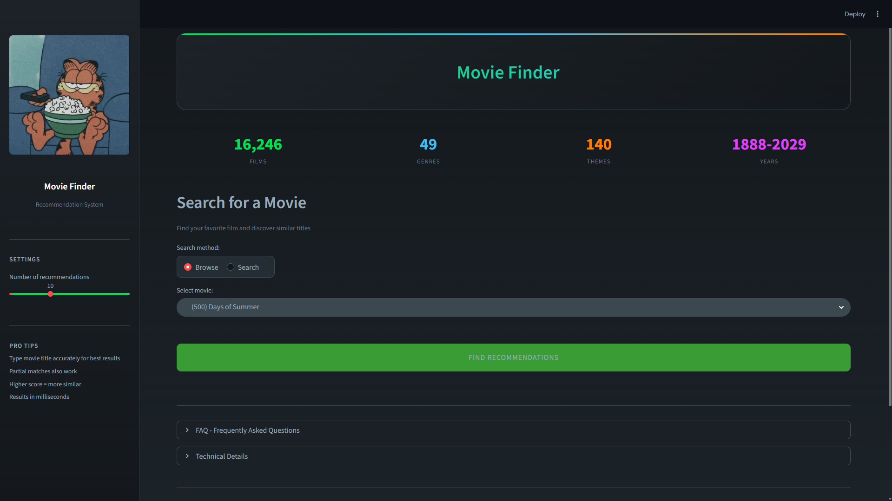

# Machine Learning Movie Recommendation System

A content-based movie recommendation system built with Python and Streamlit. Uses TF-IDF vectorization and cosine similarity to find movies with similar characteristics.

## Features

- **Content-Based Filtering** - Recommends movies based on genre and theme similarity
- **16,000+ Movies** - Large dataset with comprehensive movie information
- **Fast Search** - Query results in under 100ms
- **Modern UI** - Letterboxd-inspired dark theme design

## Tech Stack

- **Python** - Core programming language
- **Streamlit** - Web application framework
- **Pandas** - Data manipulation
- **Scikit-learn** - TF-IDF vectorization
- **SciPy** - Sparse matrix operations

## Installation

1. Clone the repository
```bash
git clone https://github.com/fawwazking/moive-rec-system-ml.git
cd movie-recommendation-system
```

2. Create virtual environment
```bash
python -m venv venv
venv\Scripts\activate  # Windows
source venv/bin/activate  # Linux/Mac
```

3. Install dependencies
```bash
pip install streamlit pandas numpy scipy scikit-learn
```

4. Run the notebooks to generate the model
```bash
# Run 01_data_cleaning.ipynb first
# Then run 02_recommendation_system.ipynb
```

5. Start the application
```bash
cd data/raw/notebooks
streamlit run app.py
```

## Project Structure

```
movie-recommendation-system/
├── data/
│   └── raw/
│       ├── notebooks/
│       │   ├── 01_data_cleaning.ipynb
│       │   ├── 02_recommendation_system.ipynb
│       │   └── app.py
│       ├── processed/
│       │   ├── movie_list.csv
│       │   └── similarity_model.npz
│       └── *.csv (raw datasets)
└── README.md
```

## How It Works

1. **Data Cleaning** - Preprocesses movie data, handles missing values
2. **Feature Engineering** - Combines genre and themes into text features
3. **TF-IDF Vectorization** - Converts text features into numerical vectors
4. **Cosine Similarity** - Calculates similarity between all movies
5. **Recommendation** - Returns top N most similar movies

## Screenshots
   
## Author
Fawwaz Wijdan
s